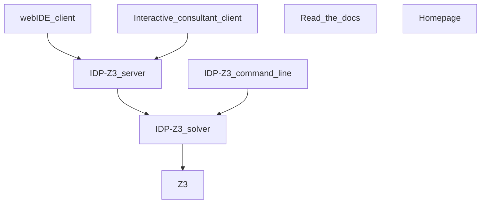

–-
title: KUL tools
tags: #Teaching
Date: 20201127120049
–-

This document presents the technical architecture of IDP-Z3.

It has these components:
* [webIDE](https://interactive-consultant.idp-z3.be/IDE) client: browser-based application to edit and run IDP-Z3 programs
* [Interactive Consultant](https://interactive-consultant.idp-z3.be/) client: browser-based user-friendly decision support application
* [Read_the_docs](http://docs.idp-z3.be/en/stable/): online documentation
* [Homepage](https://www.idp-z3.be/)
* IDP-Z3 server: web server for both web applications
* IDP-Z3 command line interface
* IDP-Z3 solver: performs inferences on IDP-Z3 theories
* [Z3](https://github.com/Z3Prover/z3): [SMT solver](https://en.wikipedia.org/wiki/Satisfiability_modulo_theories) developed by Microsoft

Essentially, these components translate the requested inferences on the knowledge base into satisfiability problems that Z3 can solve. The essential elements of the Z3 API are documented [here]((https://docs.google.com/presentation/d/1BgXIJNZJD6YTAT5k5ZSMv4irMeMA9a41EnJsIO1eK9Y/edit?usp=sharing)).

## Web clients
The clients are written in [Typescript](https://www.typescriptlang.org/), using the [Angular](https://angular.io/) framework (version 7.1), and the [primeNG](https://www.primefaces.org/primeng/#/) library of widgets.  It uses the [Monaco editor](https://www.npmjs.com/package/ngx-monaco-editor). The interactions with the server are controlled by [idp.service.ts](https://gitlab.com/krr/autoconfig3/blob/master/src/services/idp.service.ts).  The [AppSettings file](https://gitlab.com/krr/autoconfig3/blob/master/src/services/AppSettings.ts) contains important settings, such as the location of the default idp code (normally in examples/specification.idp).

The [REST.md](https://gitlab.com/krr/IDP-Z3/-/blob/master/docs/zettlr/REST.md) file describes the format of the data exchanged between the web client and the server.  The exchange of data while using web clients can be visualised in the developer mode of most browsers (Chrome, Mozilla, …).
    
## Read The Docs, Homepage
The [online documentation](http://docs.idp-z3.be/en/stable/) and [Homepage](https://www.idp-z3.be/) is written in [ReStructuredText](https://www.sphinx-doc.org/en/master/usage/restructuredtext/basics.html) and generated using [sphinx](https://www.sphinx-doc.org/en/master/) and hosted on [readthedocs.org](https://readthedocs.org/projects/idp-z3/).  The contents is in the `/docs` and `/homepage` folders of IDP-Z3.

## IDP-Z3 server
The code for the IDP-Z3 server is in the /consultant folder.

The IDP-Z3 server is written in python 3.8, using the [Flask framework](https://flask.palletsprojects.com/en/1.1.x/).  Pages are served by [rest.py](https://gitlab.com/krr/autoconfigz3/blob/master/consultant/rest.py).  Static files are served from the [/static](https://gitlab.com/krr/autoconfigz3/tree/master/consultant/static) directory, including the compiled version of the client software.

At start-up, and every time the idp code is changed on the client, the idp code is sent to the `/meta` URL by the client.  The server responds with the list of symbols to be displayed. A subsequent call (`/eval`) returns the questions to be displayed.  After that, when the user clicks on a GUI element, information is sent to the `/eval` URL, and the server responds as necessary.  

The information given by the user is combined with the idp code (in `State.py`), and the questions are put in these categories with their associated value (if any):
* given: given by the user    
* universal: always true (or false), per idp code    
* consequences: consequences of user’s input according to theory    
* irrelevant: made irrelevant by user’s input    
* unknown  

The IDP-Z3 server implements custom inferences such as the computation of relevance (`Inferences.py`).

## IDP-Z3 solver
The code for the IDP-Z3 solver and IDP-Z3-CLI is in the `/Idp` folder. The IDP-Z3 solver exposes [an API](http://docs.idp-z3.be/en/latest/IDPLanguage.html#main-block) implemented by `Run.py` and `Problem.py`.

Translating knowledge inferences into satisfiability problems that Z3 can solve involves these steps:
1.  parsing the idp code and the info entered by the user,     
2.  converting it to the [Z3](https://theory.stanford.edu/~nikolaj/programmingz3.html) format, ([guide](https://ericpony.github.io/z3py-tutorial/guide-examples.htm))    
3.  calling the appropriate method (see [API](https://docs.google.com/presentation/d/1BgXIJNZJD6YTAT5k5ZSMv4irMeMA9a41EnJsIO1eK9Y/edit?usp=sharing)),    
4.  formatting the response.

The IDP-Z3 code is parsed into an [abstract syntax tree](https://en.wikipedia.org/wiki/Abstract_syntax_tree) (AST) using the [textx package](https://github.com/textX/textX), according to [this grammar](https://gitlab.com/krr/autoconfigz3/blob/master/Idp/Idp.tx).  There is one python class per type of AST nodes (see `Parse.py` and `Expression.py`)

The conversion to the Z3 format is performed by the following passes over the AST generated by the parser:
1.  annotate the nodes by resolving names, and computing some derived information (e.g. type, or "Clark completion" of a definition) (`annotate()`)
2.  expand quantifiers in the theory, as far as possible. (`expand_quantifiers()`)
3.  when a structure is given:

    4. expand quantifiers based on the structure (grounding); perform type inference (`expand_quantifiers()`)
    5. simplify the theory using the data in the structure and the laws of logic (by `interpret()` and `update_exprs()` )
    6. instantiate the definitions for every calls of the defined symbols (recursively) (`interpret()`)
    7. convert to Z3, adding the type constraints not enforced by Z3 (`.translate()`)

The AST is modified in place.  Because the results of step 1-2 are cached, steps 4-7 are done after copying the AST (custom `copy()`).  The code is organised by steps, not by classes:  for example, all methods to substitute an expression by another are grouped in `Substitute.py`.  We use [monkey-patching](https://www.geeksforgeeks.org/monkey-patching-in-python-dynamic-behavior/) to attach methods to the classes.

## Development & Deployment
We use "[IDP enhancement proposals](https://gitlab.com/krr/IDP-Z3/-/wikis/home)" (IEP) to steer the development of IDP-Z3.

The CHANGELOG.md files follow the principles of [keepachangelog.com](https://keepachangelog.com/en/1.0.0/).   The comments on git commits follow  [Conventional Commits](https://www.conventionalcommits.org/en/v1.0.0/).  The `/docs/zettlr` folder may be used to store technical notes in markdown format (edited using [zettlr](https://www.zettlr.com/)).

Because transforming an AST is a highly recursive process, debugging it is a challenge.  It is important to simplify the IDP code as much as possible before debugging its processing.  The IDP code to be debugged can be placed in `tests/sandbox.idp`  and run using `test.py`.

To facilitate the detection of regression, the `/tests` directory of IDP-Z3 contains various idp theories, for which the tests/main.py computes various inferences and saves their results in the corresponding .z3 file.

The latest version of the documentation and homepage is deployed automatically after each push to GitLab. Deployment of the clients to[ Google App Engine](https://cloud.google.com/appengine/docs/flexible/python) is automated by the `./deploy.py` script.  

## Dependencies and Licences
The IDP-Z3 tools are published under the [GNU LGPL v3 license](https://www.gnu.org/licenses/lgpl-3.0.en.html).    

The server software uses the following components:

* [Z3](https://github.com/Z3Prover/z3): [MIT license](https://github.com/Z3Prover/z3/blob/master/LICENSE.txt)    
* [Z3-solver](https://pypi.org/project/z3-solver/): MIT license    
* [Flask](https://pypi.org/project/Flask/): BSD License (BSD-3-Clause)    
* [flask_restful](https://pypi.org/project/Flask-RESTful/) : BSD license    
* [flask_cors](https://pypi.org/project/Flask-Cors/) : MIT license    
* [pycallgraph2](https://pypi.org/project/pycallgraph2/) : GNU GPLv2    
* [gunicorn](https://pypi.org/project/gunicorn/) : MIT license    
* [textx](https://pypi.org/project/textX/): MIT license
    
The client-side software uses the following components:

* [Angular](https://angular.io/): [MIT-style license](https://angular.io/license)    
* [PrimeNg](https://github.com/primefaces/primeng): [MIT license](https://github.com/primefaces/primeng/blob/master/LICENSE.md)    
* [ngx-monaco-editor](https://www.npmjs.com/package/ngx-monaco-editor): MIT license    
* [packery](https://www.npmjs.com/package/packery): GPL-3.0    
* [primeicons](https://www.npmjs.com/package/primeicons): MIT    
* [isotope-layout](https://www.npmjs.com/package/isotope-layout): GNU GPL-3.0    
* [isotope-packery](https://www.npmjs.com/package/isotope-packery): MIT    
* [core-js](https://www.npmjs.com/package/core-js): MIT    
* [dev](https://www.npmjs.com/package/dev): None    
* [git-describe](https://www.npmjs.com/package/git-describe): MIT    
* [rxjs](https://www.npmjs.com/package/rxjs): Apache 2.0    
* [tslib](https://www.npmjs.com/package/tslib): Apache 2.0    
* [zone.js](https://www.npmjs.com/package/zone.js): MIT
    