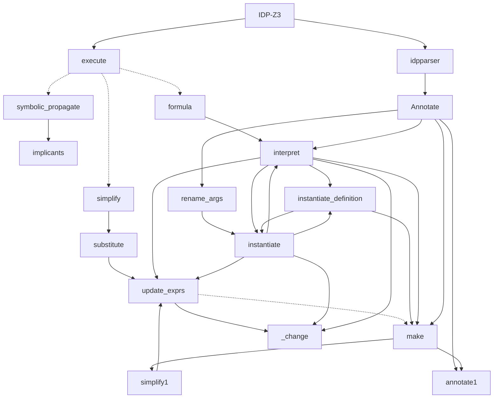

# Call graph
The following diagram is a simplification of the full graph of calls performed to transform the AST.

```mermaid
    graph TD
        IDP-Z3 --> idpparser
        IDP-Z3 --> execute

        execute -.-> symbolic_propagate;
        symbolic_propagate --> implicants;
        execute -.-> simplify;
        simplify --> substitute;
        substitute --> update_exprs;
        execute -.-> formula
        formula --> interpret

        idpparser --> Annotate
        Annotate --> interpret;
        Annotate --> rename_args;

        rename_args --> instantiate;
        interpret --> instantiate_definition;
        interpret --> instantiate;
        instantiate --> interpret;
        instantiate --> instantiate_definition;
        instantiate_definition --> instantiate;
        interpret --> update_exprs;

        update_exprs -.-> make;
        instantiate_definition --> make;
        update_exprs --> _change;
        interpret --> make;
        simplify1 --> update_exprs;
        make --> simplify1;
        Annotate --> annotate1;
        make --> annotate1;

        instantiate --> _change;
        interpret --> _change;

        Annotate --> make;
        instantiate --> update_exprs;

```

+ substitute → \_change
