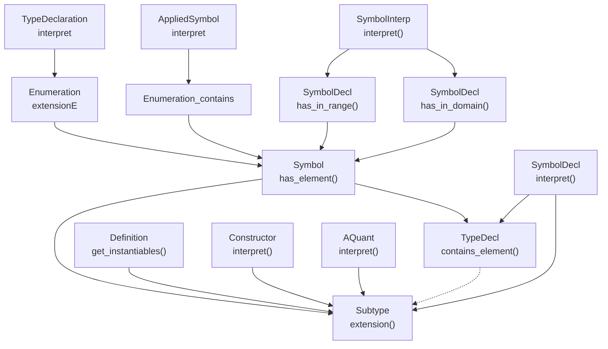

## TODO
* [ ] rename
	* [X] Subtype to Type
	* [ ] problem to Theory
* [ ] align function names in TypeDeclaration, SymbolDeclaration, Type
    * they should look-up theory.interpretations[ ] !
    * [x] extension(interpretations, extensions) -> (superset, filter(expr))  (instead of range(); only for predicates or types)
        * [x]  change signature of range()
    * [ ] is_defined(expr, interpretations?) (instead of has_in_domain(expr))
* [ ] filter model generation
    * [ ] domain(interpretations)

- [x] represent empty vs infinite superset
- [x] type.extension is a list of list
- [x] use function for filter in interpret
- [x] remove TypeDeclaration.range
- [x] remove SymbolDeclaration.in_domain
- [x] proper product of filter
- [x] use interpretations in extensions (beware of circularity !)
- [ ] allow predicate in signature
	- [x] SymbolDeclaration.translate(): need to find the type of a unary predicate
	- [x] SymbolDeclaration.contains_element()
	- [x] n-ary quantification in LivingBeing
	- [x] interpretation also defines the domain
	- [x] use extension in model expand
	- [x] use extension in propagate
	- [x] exclude similar models
- [ ] take ":>=" into account (for predicates)
- [x] improve contains_element, has_element
- [x] IC: z3 sort expected

## Call tree

