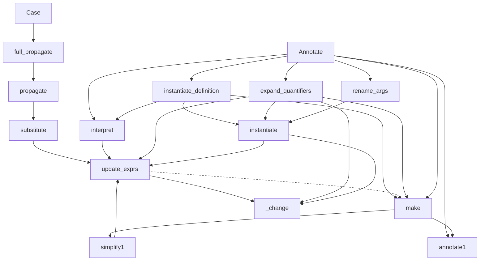

–-
title: Substitute
tags: #documentation
Date: Substitute
–-

## Call graph
(Partial) Call graph for Idp.Substitute, Idp.Simplify modules:



+ substitute → \_change


Possible performance improvement of substitute(), but is missing some substitutions !
```py
if todo is  not  None: \# not for expand_quantifiers, interpret
    if  all(e not  in  self.\_unknown\_symbols for e in e0.unknown_symbols()):
				        return  self
```

