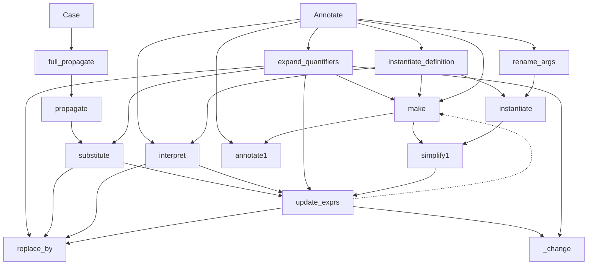

Notation: $\varphi_p$ is a formula $\varphi$ having a (tentative) proof p.  A proof is a list of atoms (not of literals).  The proof is final when $\varphi$ is $\top$ or $\bot$.
$(original)$ is the formula before any substitutions

Todo:
- [x] implications have arity 2 only
- [x] check that replace_by arguments does not include self.proof
- [x] if phi then a else a → a 
- [x] don't add brackets in replace_by if not bool
- [x] add typeConstraints
- [ ] replace by True/false → add to consequences (stash: consequences)
- [ ] proof when all conjuncts/disjuncts are False/True
- [ ] proof for arithmetic, comparison
- [ ] Expression.substitutions(), not Assignments.substitutions
- [ ] simplify Case.propagate

- [ ] consequences, todo as dictionary → re-use previous results
- [ ] batch substitutions together
- [ ] theory = And(constraints) to avoid loops. But beware of Environmental

## Substitute
$$
(1a) \begin{cases}
% no change
\psi_{p} [\varphi \rarr truth]    & \rightarrowtail \psi_{p} \\
% -> T
\varphi_{p} [\varphi \rarr \top] & \rightarrowtail \top_{\varphi} \\
% -> F
\varphi_{p} [\varphi \rarr \bot] & \rightarrowtail \bot_{\varphi}\\
\end{cases} \\
(1b) \begin{cases}
% down
(t=u)_{p} [x \rarr a] & \rightarrowtail (t[x \rarr a]=u[x \rarr a])_p \\
x[x \rarr a] & \rightarrowtail a_{x=a} \\
% t=a
%(t_{p^1}=a_{p^2}) & \rightarrowtail (t_{p^1}=a_{p^2}) ~~~~ consequences: [(t=a) \rarr \top, t \rarr  a] \\
% a=u
%(a_{p^1}=u_{p^2}) & \rightarrowtail (a_{p^1}=u_{p^2}) ~~~~ consequences: [(u=a) \rarr \top, u \rarr a] \\
% a=a
(a_{p^1}=a_{p^2}) & \rightarrowtail (\top)_{p^1+p^2}  ~~~~ consequences: [(original) \rarr \top]\\
% a=b
(a_{p^1}=b_{p^2}) & \rightarrowtail (\bot)_{p^1+p^2}  ~~~~ consequences: [(original) \rarr \bot]
\end{cases}
$$
where a, b are ground terms. 

#### Bracket
$$
(2) \begin{cases}
(\psi_p) [\varphi \rarr truth]   & \rightarrowtail (\psi_p[\varphi \rarr truth]) \\
(\top_p) & \rightarrowtail (\top_p)_p  ~~~~ consequences: [(original) \rarr \top] \\
(\bot_p) & \rightarrowtail (\bot_p)_p  ~~~~ consequences: [(original) \rarr \bot]
\end{cases} 
$$

#### Negation
$$
(3) \begin{cases}
(\lnot \psi_{p}) [\varphi \rarr truth]    & \rightarrowtail \lnot (\psi_{p} [\varphi \rarr truth]) \\
\lnot \top_p & \rightarrowtail (\bot)_p   ~~~~ consequences: [(original) \rarr \bot]\\
\lnot \bot_p & \rightarrowtail (\top)_p  ~~~~ consequences: [(original) \rarr \top]
\end{cases}
$$

#### Conjunction
Note: $p$ is the (partial) proof that the conjunction is true

$$
(4) \begin{cases}
% no proof
%(\psi^0 \land…\land \psi^{i})    & \rightarrowtail  (\psi^0 \land…\land \psi^{i})_{(\psi^0 \land…\land \psi^{i})} \\
% down
(\psi^0_{p^0} \land…\land \psi^{i}_{p^i})_p[\phi \rarr truth]    & \rightarrowtail 
(\psi^0_{p^0}[\phi \rarr truth] \land…\land \psi^i_{p^i}[\phi \rarr truth])_p \\
% T &
(\top_{p^0} \land \psi^1_{p^1} \land…\land \psi^{i}_{p^i})_p    & \rightarrowtail 
(\psi^1_{p^1} \land…\land \psi^{i}_{p^i})_{p+p^0} \\
% T
(\top_{p^0})_p    & \rightarrowtail (\top_{p^0})_{p+p^0}  ~~~~ consequences: [(original) \rarr \top] \\ 
%+ S(\psi^0, \top) +truth+S(\psi^i, \top) \\
% F &
(\bot_{p^0} \land \psi^1_{p^1} \land…\land \psi^{i}_{p^i})_p    & \rightarrowtail 
(\bot)_{p^0} ~~~~ consequences: [(original) \rarr \bot]
\end{cases}
$$

#### Disjunction
Note: $p$ is the (partial) proof that the disjunction is false

$$
(5) \begin{cases}
% no proof
% (\psi^0 \lor…\lor \psi^{i})    & \rightarrowtail (\psi^0 \lor…\lor \psi^{i})_{(\psi^0 \lor…\lor \psi^{i})} \\
% down
(\psi^0_{p^0} \lor…\lor \psi^{i}_{p^i})_p[\phi \rarr truth]    & \rightarrowtail 
(\psi^0_{p^0}[\phi \rarr truth] \lor…\lor \psi^i_{p^i}[\phi \rarr truth])_p \\
% T |
(\top_{p^0} \lor \psi^1_{p^1} \lor…\lor \psi^{i}_{p^i})_p    & \rightarrowtail  
\top_{p^0}  ~~~~ consequences: [(original) \rarr \top]\\
% F |
(\bot_{p^0} \lor \psi^1_{p^1} \lor…\lor \psi^{i}_{p^i})_p    & \rightarrowtail
(\psi^1_{p^1} \lor…\lor \psi^{i}_{p^i})_{p+p^0} \\
% F
(\bot_{p^0})_p    & \rightarrowtail
(\bot_{p^0})_{p+p^0} ~~~~ consequences: [(original) \rarr \bot] \\
% + S(\psi^0, \bot) +...+S(\psi^i, \bot)
\end{cases}
$$

#### Implication

$$
(6) \begin{cases}
% no proof
% (\psi^0 \Rarr…\Rarr \psi^{i})    & \rightarrowtail (\psi^0 \Rarr…\Rarr \psi^{i})_{(\psi^0 \Rarr…\Rarr \psi^{i})} \\
% down
(\psi^0_{p^0} \Rarr \psi^{1}_{p^1})[\phi \rarr truth]    & \rightarrowtail 
(\psi^0_{p^0}[\phi \rarr truth] \Rarr \psi^1_{p^1}[\phi \rarr truth]) \\
% F =>
(\bot_{p^0} \Rarr \psi^1_{p^1})    & \rightarrowtail  
(\top)_{p^0}  ~~~~ consequences: [(original) \rarr \top]\\
% => T
(\psi^0_{p^0} \Rarr \top_{p^1})    & \rightarrowtail
(\top)_{p^1}  ~~~~ consequences: [(original) \rarr \top]\\
% T =>
(\top_{p^0} \Rarr \psi^1_{p^1})    & \rightarrowtail  
(\psi^1_{p^0+p^1}) \\
% => F
(\psi^0_{p^0} \Rarr \bot_{p^1})    & \rightarrowtail
\lnot (\psi^0_{p^0+p^1}) \\
\end{cases}
$$

The last 2 transformations are a bit abusive. Brackets do not have temporary proofs.

#### Equivalence
$$
(7) \begin{cases}
% no proof
% (\psi^0 \Lrarr…\Lrarr \psi^{i})   & \rightarrowtail (\psi^0 \Lrarr…\Lrarr \psi^{i})_{(\psi^0 \Lrarr…\Lrarr \psi^{i})} \\
% down
(\psi^0_{p^0} \Lrarr…\Lrarr \psi^{i}_{p^i})_p[\phi \rarr truth]    & \rightarrowtail 
(\psi^0_{p^0}[\phi \rarr truth] \Lrarr…\Lrarr \psi^i_{p^i}[\phi \rarr truth])_p \\
% T ⇔
(\top_{p^0} \Lrarr \psi^1_{p^1} \Lrarr…\Lrarr \psi^{i}_{p^i})_p    & \rightarrowtail  
(\top_{p^0} \land \psi^1_{p^1} \land…\land \psi^{i}_{p^i})_p \\
% F ⇔
(\bot_{p^0} \Lrarr \psi^1_{p^1} \Lrarr…\Lrarr \psi^{i}_{p^i})_p    & \rightarrowtail
(\top_{p^0} \land \lnot \psi^1_{p^1} \land…\land \lnot \psi^{i}_{p^i})_p \\
\end{cases}
$$

#### If Then Else

$$
(6) \begin{cases}
% no proof
% (\psi^0 \Rarr…\Rarr \psi^{i})    & \rightarrowtail (\psi^0 \Rarr…\Rarr \psi^{i})_{(\psi^0 \Rarr…\Rarr \psi^{i})} \\
% down
(if~ \psi^0_{p^0} ~then~ \psi^{1}_{p^1} ~else~\psi^{2}_{p^2})[\phi \rarr truth]    & \rightarrowtail 
(if~ \psi^0_{p^0}[\phi \rarr truth]) ~then~ (\psi^1_{p^1}[\phi \rarr truth]) ~else~ (\psi^{2}_{p^2}[\phi \rarr truth])) \\
% if T
(if~ \top_{p^0} ~then~ \psi^{1}_{p^1} ~else~\psi^{2}_{p^2})    & \rightarrowtail  
(\psi^{1}_{p^1})_{p^0}\\
% if T
(if~ \bot_{p^0} ~then~ \psi^{1}_{p^1} ~else~\psi^{2}_{p^2})    & \rightarrowtail
(\psi^{2}_{p^2})_{p^0}\\
% then a else a
(if~ \psi^0_{p^0} ~then~ \psi^{1}_{p^1} ~else~ \psi^{1}_{p^2})    & \rightarrowtail  
(\psi^1_{p^1})_{p^1+p^2} \\
% if psi then T else F
(if~ \psi^0_{p^0} ~then~ \top_{p^1} ~else~ \bot_{p^2})    & \rightarrowtail
(\psi^0_{p^0})_{p^1+p^2} \\
% if psi then F else T
(if~ \psi^0_{p^0} ~then~ \bot_{p^1} ~else~ \top_{p^2})    & \rightarrowtail
(\lnot \psi^0_{p^0})_{p^1+p^2}
\end{cases}
$$

#### Defined symbols
Notation: $\psi_{[\phi]}$ means that $\psi$ is subject to definition $\phi$.

$$
(6) \begin{cases}
% down
(\psi^0_{p^0} ~then~ \psi^{1}_{p^1} ~else~\psi^{2}_{p^2})[\phi \rarr truth]    & \rightarrowtail 
(if~ \psi^0_{p^0}[\phi \rarr truth]) ~then~ (\psi^1_{p^1}[\phi \rarr truth]) ~else~ (\psi^{2}_{p^2}[\phi \rarr truth])) \\
% if T
(if~ \top_{p^0} ~then~ \psi^{1}_{p^1} ~else~\psi^{2}_{p^2})    & \rightarrowtail  
(\psi^{1}_{p^1})_{p^0}\\
% if T
(if~ \bot_{p^0} ~then~ \psi^{1}_{p^1} ~else~\psi^{2}_{p^2})    & \rightarrowtail
(\psi^{2}_{p^2})_{p^0}\\
% then a else a
(if~ \psi^0_{p^0} ~then~ \psi^{1}_{p^1} ~else~ \psi^{1}_{p^2})    & \rightarrowtail  
(\psi^1_{p^1})_{p^1+p^2} \\
% if psi then T else F
(if~ \psi^0_{p^0} ~then~ \top_{p^1} ~else~ \bot_{p^2})    & \rightarrowtail
(\psi^0_{p^0})_{p^1+p^2} \\
% if psi then F else T
(if~ \psi^0_{p^0} ~then~ \bot_{p^1} ~else~ \top_{p^2})    & \rightarrowtail
(\lnot \psi^0_{p^0})_{p^1+p^2}
\end{cases}
$$
## Substitutions
$S(\varphi, \top)$ is the list of substitutions we can infer from assuming $\varphi$ is $\top$.

$$
\begin{aligned}
S(\varphi, truth) & = [\varphi \rarr truth] \\
S(t=u, \top) & = [t \rarr u, u \rarr t](1) \\
S(\lnot \varphi, \top) & = S(\varphi, \bot) \\
S(\lnot \varphi, \bot) & = S(\varphi, \top) \\
S(\psi^0 \land…\land \psi^{i}, \top) & = S(\psi^0, \top) + ...+S(\psi^i, \top) \\
S(\psi^0 \lor…\lor \psi^{i}, \bot) & = S(\psi^0, \bot) + ...+S(\psi^i, \bot)
\end{aligned}
$$
(1) excluding substitution of a ground term.

## Propagation

```py
todo = S(theory, True)
while todo:
    todo1 = []
    theory = substitute(theory, consequences, *todo1)
    add consequences to Case.assignments
    todo = S(theory,True)
    add todo to Case.assignments
```

## Call graph
(Partial) Call graph for Expression.substitute():



+ substitute → \_change


Possible performance improvement of substitute(), but is missing some substitutions !
```py
if todo is  not  None: \# not for expand_quantifiers, interpret
    if  all(e not  in  self.\_unknown\_symbols for e in e0.unknown_symbols()):
				        return  self
```

#documentation