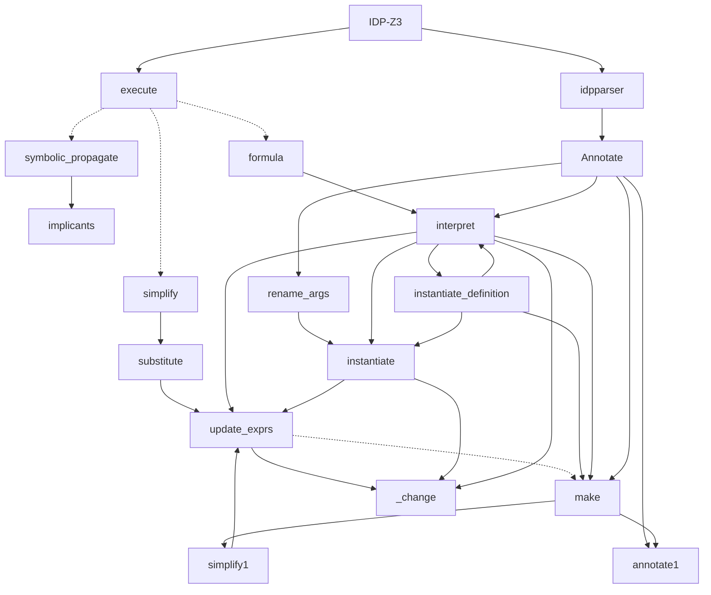

–-
title: Substitute
tags: #analysis
Date: Substitute
–-

## Call graph
(Partial) Call graph for idp_solver.Substitute, idp_solver.Simplify modules:
The following diagram is a simplification of the full call tree, focusing on the transformations of the AST.



+ substitute → \_change


Possible performance improvement of substitute(), but is missing some substitutions !
```py
if todo is  not  None: \# not for expand_quantifiers, interpret
    if  all(e not  in  self.\_unknown\_symbols for e in e0.unknown_symbols()):
				        return  self
```

