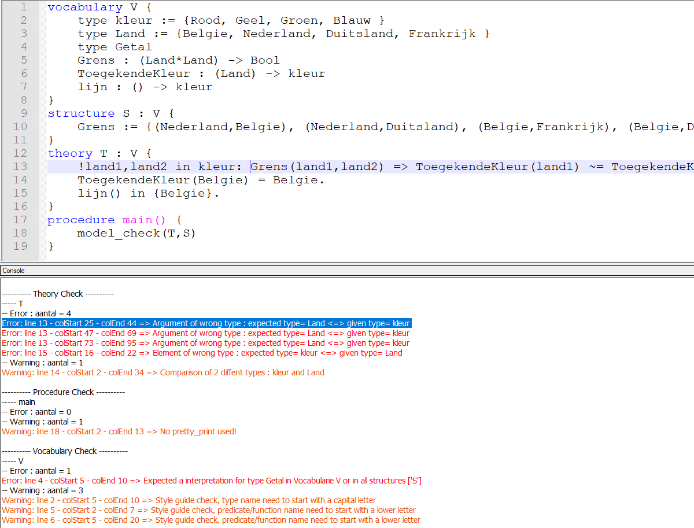

# FOLint support in Notepad++

This is a brief guide detailing how to use the FOLint tool in Notepad++.
FOLint is a linting tool for FO(·), a language used by the IDP system.

Firstly, you need to install FOLint. 

Secondly, we need to install the necessary Notepad++ plugins. 
The plugins we need are [NppEventExec](https://github.com/MIvanchev/NppEventExec) and [NppExec](https://github.com/d0vgan/nppexec), which are most likely already installed.
If not, you can go in Notepad++ to Plugins and install them.

Next, go to plugins, select NppExec and choose `execute`.
Here you need to make a command and give it a name like "FOLint". Don't forget to save it.

```
NPP_SAVE
 cd "$(FULL_CURRENT_PATH)"
 env_set PYTHONIOENCODING=utf-8
 python -u -m pylint "$(FULL_CURRENT_PATH)"
```

Now you can run this by opening an .idp file, going back to NppExec execute..., and choosing "FOLint" followed by clicking on run.
This will add a Console window at the bottom of Notepad++'s window. 
In this window you will see the output of FOLint package.

Then you go to the NppEventExec plugin to make an event on wich this command needs to be executed.
You choose 'Add rules', where you add a new rule. 
You give this rule a name. Then choose event NPPP_FILESAVED, to execute it when you save your file. 
Next you fill ".*[^.]\.(idp) " in by regex, this to only used this event on .idp files. 
At last you give the name of command you made in the NppExec plugin, 'folint', and tick the checkbox of 'enabled'.

Now everytime you save your .idp, folint will be executed and show the output in the console window.
To make the output warnings/errors clickable to go to the line were the warning/error is located in the code.

You go again to the NppExec plugin and choose "Console Output Filters..". Choose tab HighLight.
Tick the first two checkboxes and fill in the corresponding texbox follow rules in: 
first one = "Warning: line %LINE% - colStart %CHAR%Fill" and 
the second one = "Error: line %LINE% - colStart %CHAR%".
Then you can choose the colors of errors/warnings.

If everything is done the output line are clickable and show the corresponding line in the code were the warning/error is located.

Syntax Highlighting
-------
You can easily add syntax highlighting for FOdot in Notepadd++. 

First you open Notepad++ and click on Syntaxis. 
Then choose custom syntax. Click import and choose FOdot_SyntaxHighlighting.xml file.

Now you open an .idp file an choose in Syntaxis tab the FOdot syntax highligting.

Example
-------

