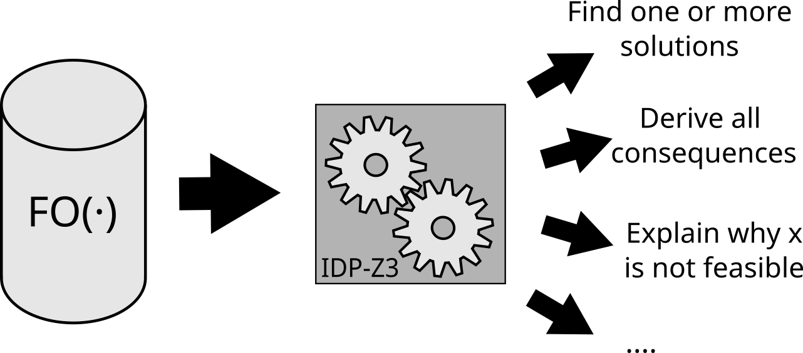

Introduction
============

IDP-Z3 is a reasoning engine for knowledge represented using the FO(·) language.

FO(·) (aka FO-dot) is First Order logic, with various extensions to make it more expressive: types, arithmetic, inductive definitions, aggregates, and intensional objects.

Once the knowledge of a problem domain is encoded in FO(·), the engine can perform a variety of reasoning tasks: find relevant questions to solve a particular problem, derive consequences from new information, explain how it derived these consequences, find a solution that minimizes a cost function, ...

IDP-Z3 is developed by the Knowledge Representation group at KU Leuven in Leuven, Belgium, and made available under the `GNU LGPL v3 License <https://www.gnu.org/licenses/lgpl-3.0.txt>`_.
It uses the `Microsoft Z3 solver <https://github.com/Z3Prover/z3>`_ as back-end to perform the reasoning tasks.
(The previous version of the reasoning engine, `IDP3 <https://wms.cs.kuleuven.be/dtai/pages/software/idp/idp>`_, used minisat)

The IDP-Z3 engine is available for experimentation through its `online IDE <https://interactive-consultant.IDP-Z3.be/IDE>`_.

Projects
--------
The IDP-Z3 reasoning engine is currently deployed in the following open-source projects:

* the `Interactive Consultant <interactive_consultant.html>`_, a tool enabling experts to encode their knowledge of a problem domain, and to automatically create an interactive web tool that helps end users find solutions for specific problems in that domain.
* `DMN-IDP <https://dmn-idp.herokuapp.com/>`_, a user-friendly tool which combines the readability of the Decision Model and Notation (DMN) standard with the power of the IDP system through an interactive interface.

IDP-Z3 is also used commercially for:

* automated collateral management in `OSCAR <https://www.clearstream.com/clearstream-en/products-and-services/global-securities-financing/global-liquidity-hub-icsd-services/triparty-collateral-services-cmax-/oscar>`_, developed by `Intelli-Select <https://intelli-select.com/>`_ in collaboration with ClearStream

Additionally, IDP-Z3 is also used in private projects by companies such as Saint-Gobain and Flanders Make.
These projects use a data-poor, knowledge-rich approach to Artificial Intelligence to leverage the knowledge of the experts in their fields.
Our partners particularly appreciate the ease of encoding this knowledge in FO(·): its expressivity removes a long-standing barrier in the use of Knowledge Base systems.

Get in touch?
-------------

Feel free to contact us `on matrix <https://matrix.to/#/#IDP-Z3:matrix.org>`_ or `by mail <mailto:krr@cs.kuleuven.be>`_.

We are always interested in collaborating with you to see how we can get the most out of IDP-Z3 within your company.

Testimonial
~~~~~~~~~~~

    KU Leuven has been our research partner as of the start of our commercial activities.
    Since then, the DTAI research group has supported us along the way in providing academic background to some of our developments, and even developing innovative solutions for our clients together.
    Our collaboration is fruitful for all parties involved: we, at Intelli-Select, get to present our clients with unseen industry solutions pushing the envelope of what's possible or imaginable further than what's currently available in the market; and at the same time, we provide new research questions and potential applications to the amazingly brilliant people at KU Leuven for further investigation.
    So far it has been a pleasure and we are looking forward to continue working with the professional and highly skilled team at KU Leuven.

    -- Bart Coppens, Intelli-Select
