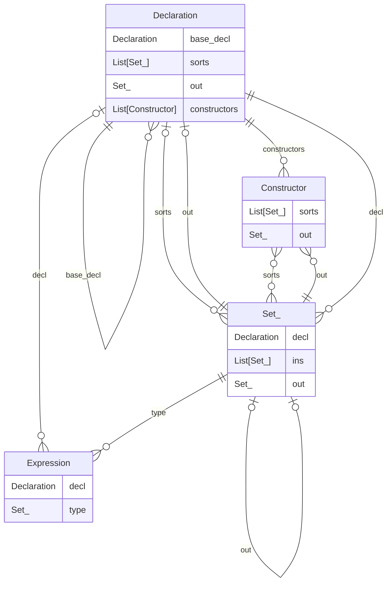

---
Datamodels
---

For typing:

```mermaid
erDiagram
    Declaration ||--o{ Declaration : base_decl
    Set_ }o--|| Declaration: decl
    Declaration |o--o{ Set_ : sorts
    Declaration |o--|| Set_: out
    Declaration |o--o{ Expression: decl
    Set_ |o--o{ Set_: ins
    Set_ |o--o| Set_: out
    Set_ ||--o{ Expression: type
    Constructor }o--o{ Set_ : sorts
    Constructor }o--|| Set_ : out
    Declaration ||--o{ Constructor: constructors

    Declaration {
        Declaration base_decl
        List[Set_] sorts
        Set_ out
        List[Constructor] constructors
    }
    Set_ {
        Declaration decl
        List[Set_] ins
        Set_ out
    }
    Expression {
        Declaration decl
        Set_ type
    }
    Constructor {
        List[Set_] sorts
        Set_ out
    }
```

