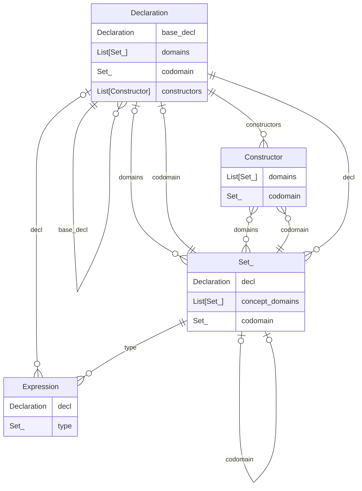

---
Datamodels
---

For typing:

```mermaid
erDiagram
    Declaration ||--o{ Declaration : base_decl
    Set_ }o--|| Declaration: decl
    Declaration |o--o{ Set_ : domains
    Declaration |o--|| Set_: codomain
    Declaration |o--o{ Expression: decl
    Set_ |o--o{ Set_: concept_domains
    Set_ |o--o| Set_: codomain
    Set_ ||--o{ Expression: type
    Constructor }o--o{ Set_ : domains
    Constructor }o--|| Set_ : codomain
    Declaration ||--o{ Constructor: constructors

    Declaration {
        Declaration base_decl
        List[Set_] domains
        Set_ codomain
        List[Constructor] constructors
    }
    Set_ {
        Declaration decl
        List[Set_] concept_domains
        Set_ codomain
    }
    Expression {
        Declaration decl
        Set_ type
    }
    Constructor {
        List[Set_] domains
        Set_ codomain
    }
```

