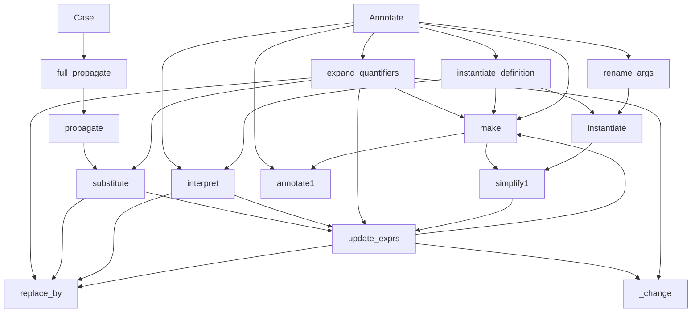

(Partial) Call graph for Expression.substitute():

```mermaid
graph TD
    expand_quantifiers --> make;
    Annotate --> expand_quantifiers;
    Annotate --> interpret;
    Annotate --> instantiate_definition;
    Annotate --> rename_args;
    
    Case --> full_propagate;
    full_propagate --> propagate;
    propagate --> substitute;
    substitute --> update_exprs;
    
    expand_quantifiers --> substitute;
    expand_quantifiers --> replace_by;
    interpret --> update_exprs;
    expand_quantifiers --> update_exprs;
    substitute --> replace_by;
    interpret --> replace_by;

    update_exprs --> replace_by;
    update_exprs --> _change;
    update_exprs --> make;
    make --> simplify1;
    Annotate --> annotate1;
    make --> annotate1;
    
    expand_quantifiers --> _change;

    instantiate_definition --> instantiate;
		    rename_args --> instantiate;
    instantiate_definition --> interpret;
    instantiate_definition --> make;
    Annotate --> make;
    instantiate --> simplify1;
    simplify1 --> update_exprs;

```

+ substitute → \_change